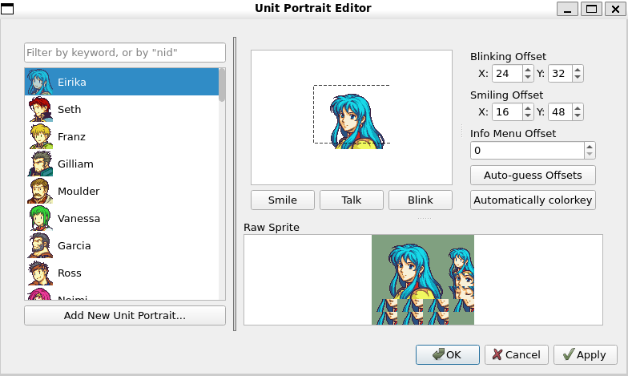
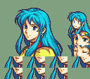
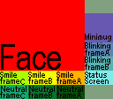
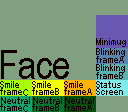
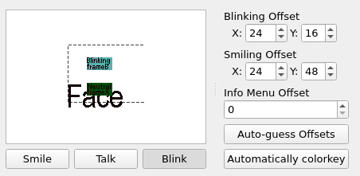
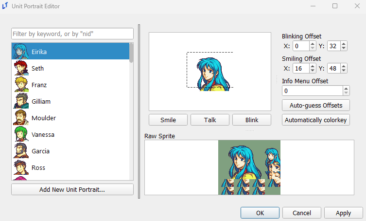
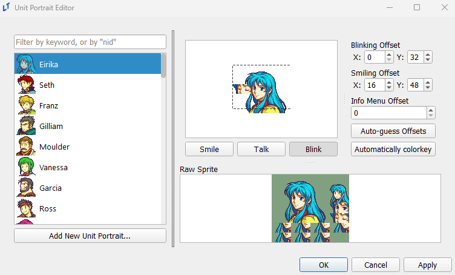
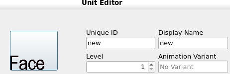

# Portraits Editor

_last updated 2025-04-20_

The Portraits Editor lets you add or modify portraits that can be used for characters in the engine.

## Adding New Portraits

Portraits are imported as PNGs in a single sprite sheet. The **Raw Sprite** preview section on the bottom right of the Portrait Editor shows the format that the editor expects a portrait to be in. There are a few components to the portrait format.

**Dimensions**: The editor expects sprite sheets to be 128x112 pixels.

**Background Color**: The editor wants the background color to be the `#80a080` hex code shade of green. This is a very specific color that the engine is set to ignore, allowing for a transparent background in game. The editor will try to force the background color of your imported sprite sheet to be green.

**Sections**: The image below specifies the sections expected in the sprite sheet. There is some extra unused space at the top and bottom right that is in the shade `#80a080`. There are 11 sections in the portrait sprite sheet, these are separated more generally into: face, minimug, eyes, and mouth sections. The mouth sections are split into smile frame A-C, neutral frame A-C and status screen frame. The eye sections are split into blinking frame A-B. These frames are overlaid onto the face to create talking and blinking animations.

Make sure your portraits are in this specific format before you add it to the editor. Feel free to download the above image to use as a template for creating sprite sheets.

## Adding a New Portrait

You can add new portraits by clicking the `Add New Unit Portrait...` button. This will bring up a window for you to navigate to your PNG sprite sheet to import it into the editor.

After importing, the editor will run two automatic steps. If the portrait sprite sheet is given in the correct format as described above, the editor will automatically try to place the mouth and eye frames on the face based on image similarity. If the editor fails to find a matching location the mouth and eye frames will be placed in the top left. The editor will also automatically recolor the background of the portrait sprite sheet to be `#80a080` based on the background color of the face section.

The editor *will not* initially make a copy of the file you import. This means that the automatic colorkey algorithm may modify the colors in the file you import. If that is something you care about make a copy of the portrait sprite and import the copy instead. Once you save your project the editor will create a copy of the portrait inside of your project.

## Modifying Existing Portraits

Editing existing portraits is as easy as opening the PNG file associated with each portrait imported into the editor in the image manipulation software of your choice and editing it. The already imported portraits can be found under `your_project.ltproj/resources/portraits/`. You can then click on the portrait in the editor and edit the extra settings.

## Editor Features

The editor has a few extra features that are available for use after importing the portrait sprite sheet. To show what they do this guide will import the above portrait format image into the editor as a demonstration.

You will notice that after importing the portrait sprite sheet into the editor the background on the face section has automatically been changed to `#80a080`. This is a feature of the editor to make importing sprite sheets from other engines that expect a different color background to be a slightly smoother process. If this feature of the editor created any problems for you refer to the [Modifying Existing Portraits](#modifying-existing-portraits) section. The editor will also automatically try to place the mouth and eye frames on the face based on image similarity. If the editor fails to find a matching location the mouth and eye frames will be placed in the top left.

The `Portrait Selector` section of the editor on the left, you can see the minimug section is previewed as the unit icon.

In the `Portrait Preview` section of the editor on the right, you can see that the editor has overlaid the neutral frame A section of the portrait sprite sheet onto the face section. The background is also transparent as the background has been changed to `#80a080`.

Below the preview, you will find three buttons: `Smile`, `Talk`, and `Blink`. These three buttons are responsible for controlling what is displayed in the preview section. `Smile` will overlay smile frame A onto the portrait. `Talk` will cycle through smile frame A-C and overlay it onto the portrait. `Blink` will quickly overlay blinking frame A before transitioning to blinking frame B. These three buttons make it easy for you to position the overlays and check what the portraits will look like in your game.

The status screen section of the portrait sprite sheet will be overlaid at the same location as the mouth frames and will be used when displaying the character in the info/status screen in the game.

On the right of the preview there are three settings you can adjust: the `Blinking Offset`, the `Smiling Offset` and the `Info Menu Offset`. The `Blinking Offset` controls where the mouth frames are overlaid over the face. The `Blinking Offset` controls where the eye frames are overlaid over the face. The `Info Menu Offset` controls the vertical offset of the entire portrait displayed in the info/status screen in game.

An example of this can be seen in the image below, where the blinking frame has been overlaid on the face by toggling the `Blink` button and all of the offsets have been adjusted to reasonable locations.

`Smile` and `Talk` will use the same `Smiling Offset` as they are both mouth frames, so you will be able to immediately spot if it is in the wrong position. However, `Blinking Offset` used by the eye frames will not be shown by default, so make sure to toggle the `Blink` option at least once to check.

 

The `Auto-guess Offsets` button runs an algorithm that tries to automatically overlay the mouth and eye frames at appropriate locations on the face based on an image similarity algorithm. If the algorithm fails you can manually adjust the offsets in the `Blinking Offset` and `Smiling Offset` fields. This step is automatically run for new sprite sheets imported into the editor. The `Automatically colorkey` button runs an algorithm that changes the background color to `#80a080` based on the background color of the face section. This step is also automatically run for new sprite sheets imported into the editor.

Press `OK` or `Apply` to save any changes.

After adding a new sprite, you can now use it as a unit portrait in the **Unit Editor**. You can see that the portrait displayed lines up with the `Info Menu Offset` selected in the portrait editor.

## Misc

When referencing a portrait directly in a `speak` command, the text log feature will use the name of the portrait within this editor as the name of the speaker in the backlog. Remember this to avoid (or subtly place) spoilers in your text.
