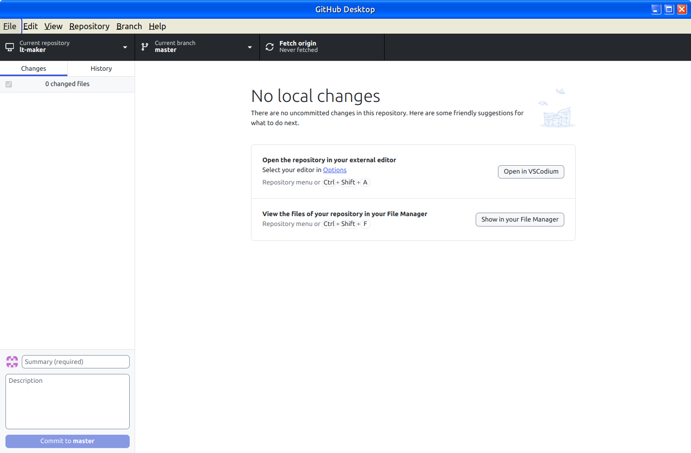
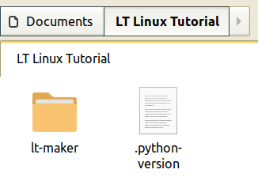
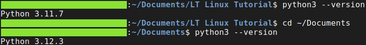
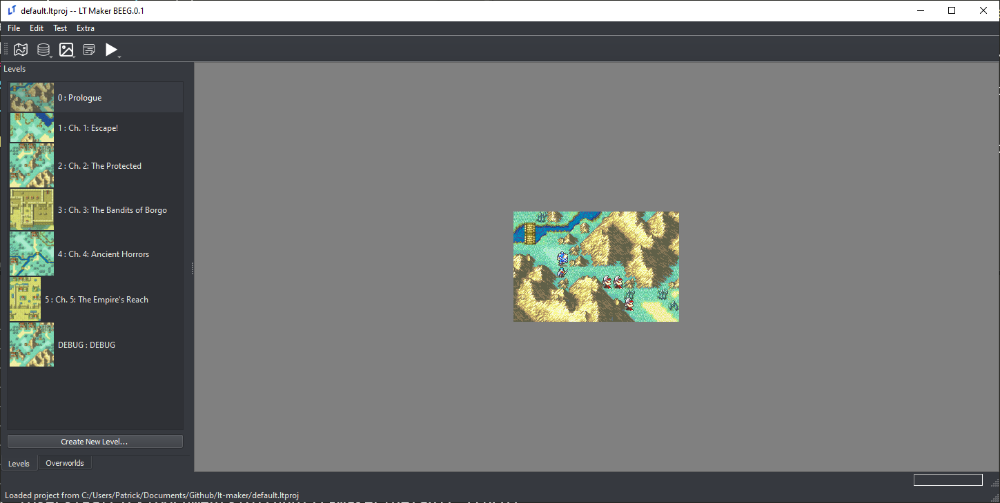
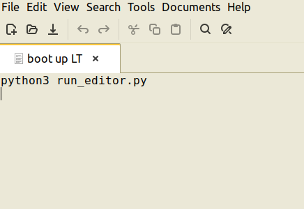

(LinuxInstall)=
# Necessary Installs (for Linux)

## Installing Git and cloning the repository.

Almost all Linux distributions come with Git by default. To check this, type `git --version` into your terminal. If it returns `git version #.##.##`, you're good to go. If it returns an error, you'll have to install Git first. 

If you're new to Git, it is highly recommended that you install the Github Desktop application for ease of use. You can usually find it in your distribution's software/package manager.

https://github.com/shiftkey/desktop

Once you've installed Github Desktop, open the program. Select 'File' in the top left, and click 'Clone repository...'. Choose the 'URL' option. In the first box, insert the following link:

```
https://gitlab.com/rainlash/lt-maker.git
```

In the second box, insert the path where you wish to store the engine. This can be any folder you want, though two things should be noted:
1. Do NOT use a folder that is synced up to cloud storage. This is likely to cause major problems down the line.
2. Create a folder to store the repository inside (for example, `Documents/LT-EDITOR`, instead of just the `Documents` folder)

Once you've decided where you want the lt-maker repository to live, click on 'Clone', and the engine will now be installed to your machine.



From this screen, you can now also update the engine by clicking the 'Fetch origin' button.

>The program may ask for you to sync a github/gitlab account, but this isn't necessary for the use of the software.

>Make sure the 'Current branch' button always shows the branch name 'master'. Otherwise, you may be running an outdated version that someone used to solve a specific problem or run their own customized lt-maker engine.

## Installing and setting up the correct Python version for lt-maker

As most Linux distributions already come with a Python version, you cannot simply install multiple Python versions. For example, Linux Mint 22.3 comes with Python 3.12.3. <span style="color: red; font-weight: bold;">LT-maker requires a Python 3.11 environment to work optimally.</span> For this, we can use a tool called 'pyenv'.

https://github.com/pyenv/pyenv

Follow the instructions on setting up the shell environment as explained on the github page. Depending on your Linux distribution, you may need to install or configure additional files. Consult the page below to see which additional dependencies your system may need.

https://github.com/pyenv/pyenv/wiki#suggested-build-environment

Once pyenv is installed correctly, type `pyenv install -l` to see all available versions of Python the program can download. Since we want a Python 3.11 version, you can use the command `pyenv install 3.11.7` for example.

Once the installation is complete, navigate to the folder where you stored the `lt-maker` folder. Open a terminal window in this folder (NOT inside the `lt-maker` folder), and type `pyenv local 3.11.7`. Then, in this same folder, type `python3 --version`. It should now return `Python 3.11.7`. If you have hidden files visible, there should be a `.python-version` file that contains the python version you specified. Ideally, your folder layout should now look like this:



<span style="color: red; font-weight: bold;">Do NOT run `pyenv global`. Always stick to `pyenv local` to set Python versions, unless you know exactly what you are doing!</span>

To make sure your main system is unaffected, open a normal terminal window and type `python3 --version`. It should return a different version than the local version you set up previously (on Linux Mint 22.3, it returns `Python 3.12.3` for example).



## Installing Pip

Pip is the Python package manager, and is a requirement for installing the engine dependencies. To check if you have pip installed, type `python3 -m pip --version` into your terminal. If it returns `pip 24.0 from /usr/lib/python3/dist-packages/pip (python 3.12)` or something akin to it, pip is working properly. If it returns an error, you need to install it first. Usually, pip can be found in your distribution's software/package manager. If it cannot be found there, consult the link below.

https://pip.pypa.io/en/stable/installation/#

>Note that some distributions require you to substitute instructions starting with `python` to `python3` while installing pip.

## Installing engine dependencies

Next, you need to install some extra dependencies. These can be found in the `requirements_editor.txt` To install them, open a terminal window <span style="color: red; font-weight: bold;">inside of the lt-maker folder</span> and type the following commands:

pygame-ce

```
python3 -m pip install pygame-ce==2.3.2
```

pyinstaller

```
python3 -m pip install pyinstaller==6.2.0
```

typing-extensions

```
python3 -m pip install typing-extensions==4.8.0
```

PyQt5
```
python3 -m pip install PyQt5==5.15.10
```

If you are using Ubuntu or an Ubuntu-based distribution, and the above PyQt5 command does not work, use the one below:

```
sudo apt-get install python3-pyqt5
```

## Launching the engine/editor

Open a terminal window inside of the `lt-maker` folder. Here, type `python3 run_engine.py`. The engine main screen should pop up and you should be able to play the Lion Throne.


If that was successful, close the engine. Open a terminal window inside of the `lt-maker` folder and type `python3 run_editor.py`. The editor should pop up and you should be able to begin making your own fangame.



If you wish, you can make a simple boot script by creating a .txt file in the `lt-maker` folder, typing `python3 run_editor.py` and saving it. Give it a creative name so you can find it easily later. Then, right click on the .txt file, and allow it to be executed as a program.

>If your file manager asks, it is recommended to run the script in the terminal, as the terminal functions as an output log for the editor. That makes troubleshooting much easier if something goes wrong!

