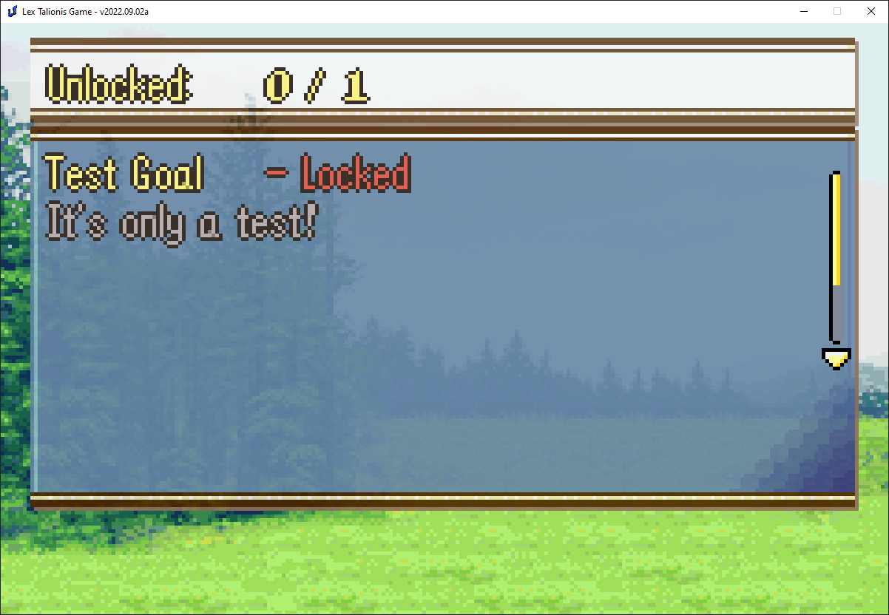

# Achievements

You may wish to create an achievement system for your game. Alternatively, you may simply want to save content outside of a given save file. This could be for a New Game+ feature, an Undertale-like playthrough system, or timeline shenanigans. This guide will cover all of these potential use cases.

## Basic Functionality

The create_achievement command creates a new achievement with the given specifications and saves it to saves/PROJECTID-achievements.p.

```create_achievement;Sample;Test Goal;It's only a test!```

Try it out by putting this line before a base event command in any given level. Test the level and go to Codex > Achievements.



Voila! You have an incomplete achievement listed there. Of course, we'd like to have the player be able to complete that achievement.

In any event you'd like, place this command:

```complete_achievement;Sample;1```

Where Sample is the NID of the achievement you created above. Run that event then check the records screen again - the achievement will be complete!

## Secret Achievements

Many games have achievements for defeating endgame bosses. In order to avoid spoilers for those bosses, we'd like to hide some achievement information from the player.

The first option we have is to only run the create_achievement command when the boss is first defeated. That way the achievement won't appear in the Records menu early, since it won't exist.

Most game platforms, like Steam, display certain achievements as "Locked" prior to their completion. Let's implement a system for our game.

Create a new achievement.

```create_achievement;KillGodOrSomething;???;Continue the story to unlock;f;f```


Players can see that they haven't unlocked all achievements, but will naturally later on. We can use the update_achievement command to change the details of the displayed achievement.

```update_achievement;KillGodOrSomething;Kill God;You managed to slay a deity.```


The details of the achievement have been updated.

## Non-achievement storage

I'd like to remember if the player has completed the game. I can't keep that data tied to a particular save file, so the achievement system is perfect here.

```
if;has_achievement("CompleteGame")
    speak;Eirika;I've won before
else
    speak;Eirika;I haven't won yet.
end
```

This block of eventing checks whether an achievement with CompleteGame as the nid has been registered. You can also check for a.name or a.desc to get the achievement's visible name and description. Run the event, and see Eirika state that she has yet to win.

Now, at the end of an event, put:

```create_achievement;CompleteGame;NA;NA;t;t```

That final argument is what matters. Setting hidden to true prevents the achievement from appearing in the Records menu. If you run the event again, you'll see that Eirika remembers that she's won before. Most importantly, if you check the base records menu you won't see the new achievement listed there.