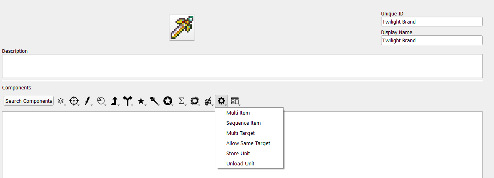
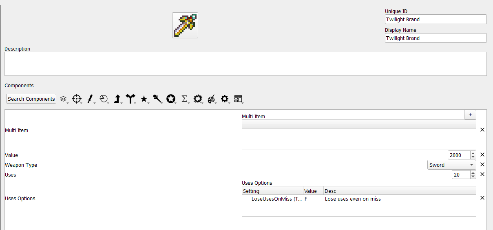
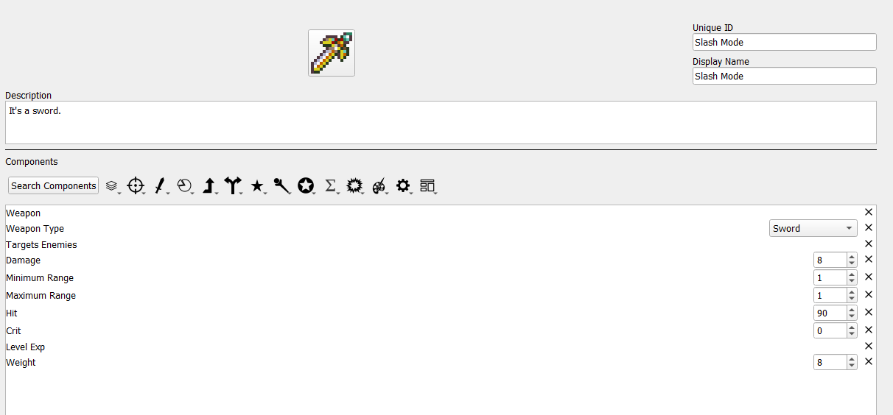
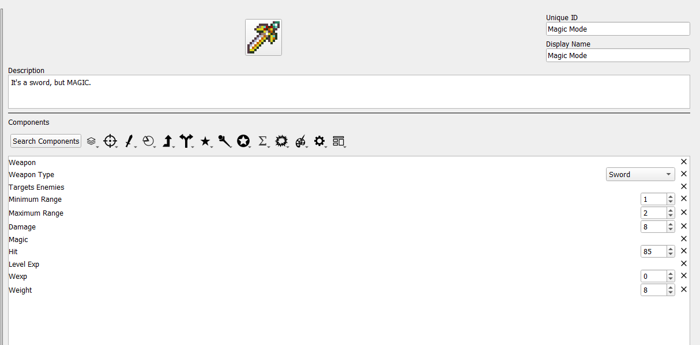
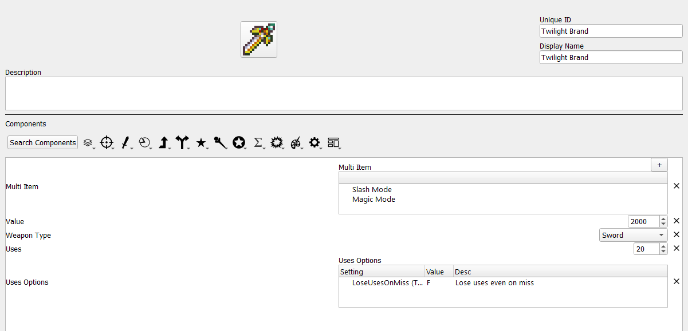

# Multi Items

## What is a multi item?

Multi items are items which consist of one or more other items. These inner items, referred to here as sub items, are usable by the unit like any other item they possess, although multi items have some unique properties:

* When an item inside a multi item is used, a use is consumed from both the multi item and its sub item. If only the multi item or sub item has infinite uses, a use is still consumed from the other.
* A unit must fulfill restrictions set by both the multi item and a sub item to use that sub item. For example, if the multi item has a sword rank and the sub item has a lance rank, the user would need both sword and lance ranks.
* Multi items are stored in the convoy based on the weapon type of the multi item, rather than any of the sub items.

## How do I make a multi item?

**Step 1: Create the multi item.**

Open the item editor and create a new item. For this example, we will be creating the Twilight Brand, a Light Brand where the user can choose whether it functions as a normal sword or a magical one. 

Once you add the Multi Item component, you should add other components that apply to the item as a whole. In this case, a weapon type, uses, and price are appropriate. Specific stats like hit rate and damage should be left to the sub items. The multi item itself is also intentionally not a weapon, as the weapons that are meant to be "equipped" are the sub items in this case.

When initially added, the multi item component will be blank. Once sub items are created, they can be added here.

**Step 3: Create sub items.**

Sub items can be created as normal. If the uses of the sub item are meant to be tied to the multi item, then no uses need to be specified. Other shared information can be omitted as well.

For this example, we grant the ability to crit and gain weapon experience to the normal form of the sword, and the ability to deal magic damage to the magical form, allowing for a Light Brand that is more difficult but rewarding to use.

**Step 4: Add the sub items to the multi item.**

Return to the multi item and use the + symbol above the multi item component to add the sub items, which will be displayed in a drop down list of all items. Theoretically any item can be added to multi item as a sub item, allowing this component great flexibility.

After this, the Twilight Brand can be used in-game as a multi item.

## Why do I make a multi item?

The scenario given in this example is fairly simple: a sword with two forms. However, multi items have many uses beyond that. They can represent a weapon with a limited-use finisher attack, by having a multi item consisting of one normal use sub item and one powerful sub item with only one use. They do not need to be limitd to weaponry, either; a multi item could be a tome with no properties of its own that contains various spells for healing or status ailments, each having its own mana cost. Thus, if you have any item at all which has more than one function, the multi item component is likely to be of use.